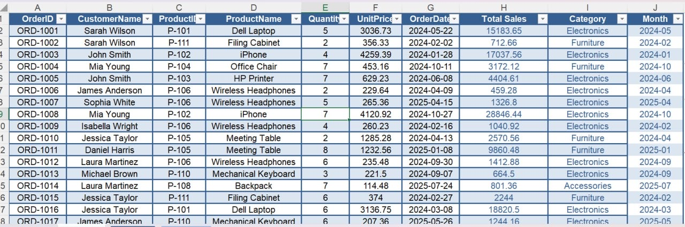
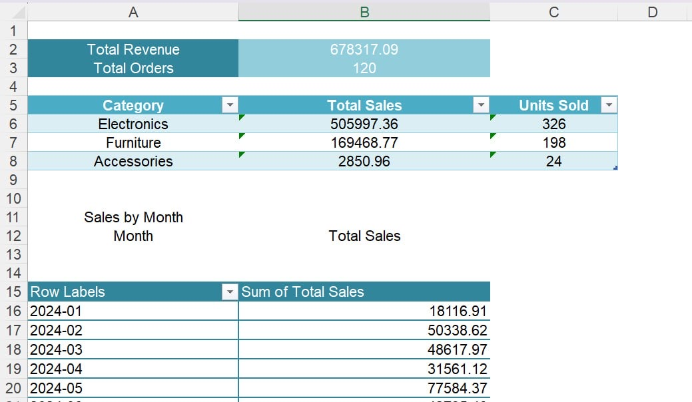
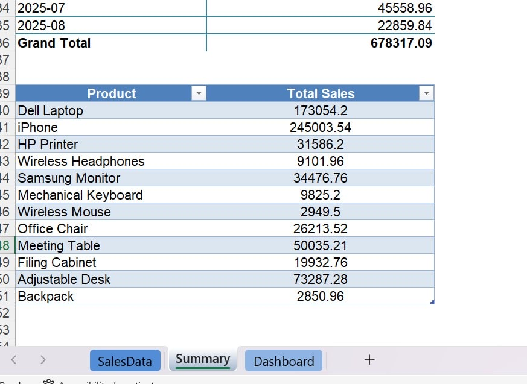
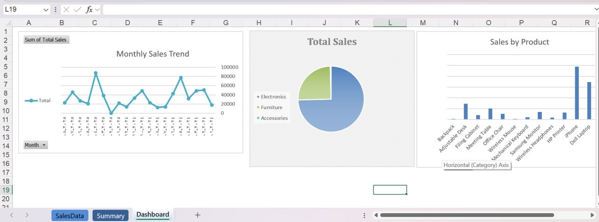

# Sales Dashboard — Excel

An end-to-end sales data analysis project built in Excel, taking raw transactional data
through cleaning, transformation, and visualization into a professional, interactive dashboard.

## What This Project Does
- **Data Cleaning**: Removed duplicate records, validated data types, standardized formatting
- **Calculated Columns**: Total Sales (Quantity × UnitPrice), Category (via VLOOKUP against a
  reference table), and Month (via TEXT function) for time-based analysis
- **Summary Sheet**: Key performance indicators (Total Revenue, Total Orders, Average Order
  Value) plus aggregated sales by category, product, and month using SUMIF and a PivotTable
- **Interactive Dashboard**: Three linked visualizations —
  - Monthly Sales Trend (Line Chart)
  - Sales Distribution by Category (Pie Chart)
  - Sales by Product (Column Chart)

## Tools & Techniques
Excel Tables · VLOOKUP · SUMIF · PivotTables · Charts · Data Cleaning

## Files
- `sample_sales_data_en (1)` — Final workbook

## Screenshots
## Screenshots

### Cleaned Data

### Summary Tables

### Final Dashboard

